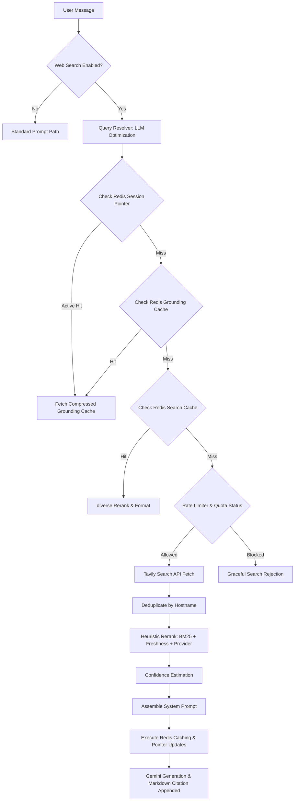
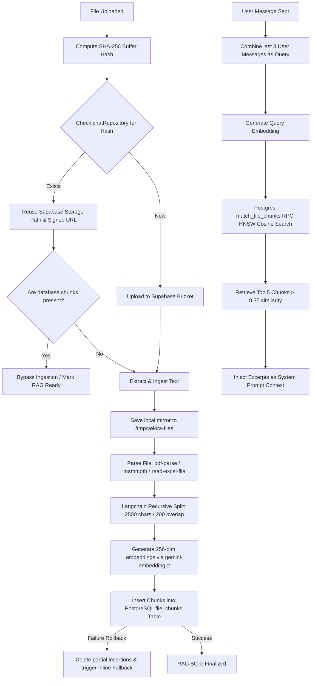

# End-to-End Architectural Analysis: Web Search, File RAG, and YouTube Transcript Extraction

This document provides a comprehensive, end-to-end technical analysis of the data flows, design patterns, and system architectures for three critical modules in the Velora AI platform:
1. **Web Search Grounding**
2. **File RAG (Retrieval-Augmented Generation)**
3. **YouTube Transcript Extraction**

---

## 1. Web Search Grounding Architecture

The Web Search module is a highly optimized, intent-driven factual grounding system that enhances LLM responses with real-time web information. It integrates advanced query optimization, multi-layered caching, intelligent rate-limiting, custom heuristic reranking, and semantic confidence scores.

### Architectural Diagram (Mermaid)



### End-to-End Data Flow

#### Step 1: LLM-Powered Query Resolution (`queryResolver.ts`)
*   **Trigger**: Triggered when `webSearchEnabled` is set to `true` in a user's chat message metadata.
*   **Processing**: Instead of querying web search engines directly with the raw user query, the system utilizes **Gemini 3.1 Flash Lite** (with **Gemini 2.0 Flash** as a fallback) to optimize terms using `QUERY_RESOLUTION_PROMPT`.
*   **Input**: The raw user message and up to the last 15 conversation turns.
*   **Output**: An optimized JSON structure consisting of:
    *   `searchQuery`: The optimized search term, resolving pronouns and context.
    *   `isFollowUp`: A boolean indicating if the current query depends on previous context.
    *   `isLiveData`: A boolean indicating if the query is seeking temporal/live data (e.g. weather, sports scores, trending events).
    *   `wantsImages`: A boolean indicating if the user's intent implies a visual request.
*   **Normalization**: The resolved query is normalized using NFKD Unicode decomposition to ensure consistency across multiple languages, forming the Redis cache key: `stable:${normalizedQuery}` or `live:${normalizedQuery}`.

#### Step 2: Multi-Tiered Cache & Rate-Limiting (`cache.ts`, `rateLimiter.ts`)
Before making external network requests, the flow goes through multiple validation layers:
1.  **Session Pointer**: A fire-and-forget Redis pointer `session:last_search:${userId}` checks if the current interaction represents an identical query session, returning the cached grounding context immediately (fast-path).
2.  **Grounding Cache**: Checks Redis under the key `grounding:${cacheKey}`.
3.  **Search Cache**: Checks Redis under the key `search:${cacheKey}`. If a match is found here, Tavily results are retrieved from cache, bypassing Tavily's quota usage, and sent directly to reranking.
4.  **Quota & Cooldown Validation**: If a cache miss occurs, the system validates constraints using Upstash Redis:
    *   **Tavily Monthly Limits**: Performs a monthly credit check. It executes a background lock-controlled fetch to `https://api.tavily.com/usage` in a fire-and-forget thread, caching it for 5 minutes. If no credits remain, it raises a `monthly_credits_exhausted` rejection.
    *   **Daily Quotas**: Enforces daily global limits (default: 40) and user daily quotas (default: 15). Quotas are tracked using daily keys (e.g., `web_search:user:daily:${id}:${dateKey}`) resetting precisely at **Indian Standard Time (IST, UTC+5:30) midnight**.
    *   **Cooldown Limits**: Prevents abuse by enforcing a 30-second cooldown between consecutive active search fetches per user using a short-lived key `web_search:cooldown:${userId}`.

#### Step 3: Tavily Search Fetch (`webSearch.service.ts`)
*   **Execution**: Connects to the **Tavily Core** SDK, issuing a `basic` depth search.
*   **Configuration**: Requests up to 10 candidates, requesting raw content formatted as markdown, and optional image links with descriptions if `wantsImages` is enabled.
*   **Fallback**: If the API call fails, it retries up to 2 times with exponential backoff (`300ms`, `600ms`, `1200ms`).

#### Step 4: Hostname Deduplication & Heuristic Reranking (`reranker.ts`)
To present highly relevant, non-redundant search contexts:
1.  **Deduplication**: Results are grouped by their root domains (e.g. using `tldts` to normalize domains), selecting the highest-scoring candidate per root hostname to ensure diverse source distribution.
2.  **MiniSearch BM25 scoring**: Generates BM25 keyword matching scores locally on titles and snippets using the lightweight `minisearch` package.
3.  **Freshness Penalty/Bonus**: Checks date-fns age in days on `publishedAt` or `lastModified`. For `isLiveData` queries, dates are strictly weighted.
4.  **Combined Ranking Function**:
    $$\text{Score} = (0.35 \times \text{Tavily Score}) + (0.30 \times \text{BM25 Score}) + (0.15 \times \text{Extractability Score}) + (0.20 \times \text{Freshness Score})$$
    *   *Extractability Score* assesses URL depth and snippet structure (numeric density, capitalized entities) representing the text richness of the source.
5.  **Selection**: Filters the top 5 results after performing Jaccard similarity checks on titles to drop overlapping duplicates.

#### Step 5: Semantic Confidence Scoring & Prompts (`confidence.ts`, `webSearch.prompts.ts`)
*   **Confidence Estimation**: Produces a classification label (`high`, `medium`, `low`) and numerical rating (capped at `0.05` to `0.95`) based on relevance metrics, freshness, source quantity, and whether full extracted text vs snippet fallback was retrieved.
*   **System Prompt Injection**: Inserts metadata (e.g., source domain, publish dates, days old) alongside excerpts into the dynamic system prompt (`WEB_GROUNDING_SYSTEM_PROMPT`). Rules force the LLM to weight by freshness, explain conflicts, cite facts exactly via brackets (e.g., `[1]`), and strictly avoid hallucinations.
*   **Appended Citations**: After streaming the assistant response, a formatted sources section is appended as markdown hyperlinks.

---

## 2. File RAG Architecture

The File Retrieval-Augmented Generation (RAG) module parses documents, breaks them into overlapping semantic units, registers their embeddings using pgvector, and retrieves the most contextual parts for prompt enrichment.

### Architectural Diagram (Mermaid)



### End-to-End Data Flow

#### Step 1: Processing Upload & Deduplication (`fileHandler.ts`)
*   **Trigger**: Triggered during chat creation or message sending when a file attachment is supplied.
*   **Deduplication**: Generates a **SHA-256 hash** of the file buffer and queries `chatRepository.findAttachmentByHash(userId, fileHash)`. If found, it fetches the existing Supabase storage path and generates a signed URL instead of performing a duplicate upload.
*   **Local Mirroring**: Saves the uploaded document under `/tmp/velora-files/` to ensure local MCP (Model Context Protocol) servers can access the physical file directly for specialized tools.
*   **Bucket Storage**: New uploads are routed to Supabase Storage via `supabaseStorageService.uploadDocument`.

#### Step 2: Document Text Parsing (`fileParser.ts`)
*   **Constraints**: Applies a hard limit of **10MB** on files.
*   **Parsers**: Based on the file extension, it maps parsing promises:
    *   `.pdf`: Uses `pdf-parse` textual scraping.
    *   `.docx`: Uses `mammoth` to extract clean, unformatted raw text.
    *   `.xlsx`: Uses `read-excel-file/node`, joining columns with a pipe (` | `) and rows with newlines.
    *   `.csv`: Uses `csv-parse/sync` to format rows as pipe-separated values.
    *   `.txt`: Converts the buffer straight to a UTF-8 string.
*   **Safety Cap**: Hard limits parsed characters to **100,000 characters** (~25,000 tokens) to ensure the embedding runtime takes only a few seconds and prevents token rate limits.

#### Step 3: Chunking & Text Splitting (`textSplitter.ts`)
*   **Tooling**: LangChain's `RecursiveCharacterTextSplitter`.
*   **Configuration**:
    *   `CHUNK_SIZE = 2500` characters (approx. 500 tokens).
    *   `CHUNK_OVERLAP = 200` characters.
*   **Rationale**: Chunks are sized to guarantee meaningful semantic density for similarity calculations while preserving contextual boundaries via overlap.

#### Step 4: Batch Vector Embedding & Postgres Ingestion (`embedding.service.ts`)
*   **Model**: Utilizes the Google GenAI SDK to generate vector embeddings using `gemini-embedding-2` (representing the Gemini 2.0 Embedding model).
*   **Dimension Control**: Restricts outputs to **256 dimensions** (`outputDimensionality: 256`) to maximize index search velocity and database performance.
*   **Batching & Delay**: Chunks are processed in batches of 32. It applies a **2-second delay between batches** and exponential backoff retry handling (re-reading rate-limit headers) to safely fit under Gemini free-tier rate limits.
*   **Database Structure**: Saves rows to the `file_chunks` table:
    *   `storage_path` (text): References the file location in Supabase storage.
    *   `chunk_text` (text): The raw textual chunk.
    *   `embedding` (vector(256)): PGVector representation.
*   **HNSW Indexing**: Uses an HNSW vector index (`vector_cosine_ops` for cosine similarity) on the `embedding` column for rapid matches.
*   **Atomic Rollbacks**: If any batch embedding fails during file ingestion, the transaction deletes all partially inserted chunks for that `storage_path` to avoid corrupted partial-retrieval states.
*   **Inline Fallback**: If ingestion errors out completely, the attachment is flagged with `inlineFallback = true`. The system bypasses semantic RAG and instead feeds the file buffer content directly into Gemini's multi-modal system context.

#### Step 5: Semantic Retrieval & Ingestion (`fileRetrieval.ts`)
*   **Query Synthesis**: To make retrieval context-sensitive, it merges the content of the **last 3 user messages** as the search query.
*   **RPC Matching**: Computes the query embedding and performs a database RPC cosine similarity match:
    ```sql
    select 1 - (file_chunks.embedding <=> query_embedding) as similarity
    from file_chunks
    where file_chunks.storage_path = filter_path
      and 1 - (file_chunks.embedding <=> query_embedding) > 0.35
    order by similarity desc
    limit 5;
    ```
*   **System Prompt Injection**: Retrieves up to 5 matching chunks with similarity $> 0.35$, concatenating them with divider symbols (`---`). This is injected into the LLM system prompts (priority 30) under `"The user provided a file. Below are the most relevant excerpts..."`.

---

## 3. YouTube Transcript Extraction Architecture

The YouTube Transcript module provides instantaneous text retrieval from YouTube videos by scraping subtitle tracks, classifying processing failures, and mapping transcripts to LLM system parameters.

### Architectural Diagram (Mermaid)

```mermaid
flowchart TD
    A[User Message] --> B{Matches YouTube Regex?}
    B -- No --> C[Skip YouTube Flow]
    B -- Yes --> D[Extract 11-char Video ID]
    D --> E[Validate format: /^[a-zA-Z0-9_-]{11}$/]
    E -- Invalid --> F[Return INVALID_URL Error]
    E -- Valid --> G[Execute fetchTranscript via parallel Promise]
    G --> H[youtube-transcript Scraper Library]
    H --> I{Success?}
    I -- No --> J[Classify Error: DISABLED / PRIVATE / RATE_LIMIT]
    I -- Yes --> K[Join Subtitle Elements as space-separated String]
    K --> L{Exceeds max length?}
    L -- Yes --> M[Truncate & Set truncated: true]
    L -- No --> N[RAG Ready Transcript]
    M --> N
    N --> O[Inject Transcript into System Prompt context]
    O --> P[Assemble System Prompt Priority 30]
```

### End-to-End Data Flow

#### Step 1: Regex Matching & Validation (`chat.service.ts`, `transcript.ts`)
*   **Regex Trigger**: The main chat service matches the latest user input message against a standard YouTube pattern:
    ```javascript
    /(?:https?:\/\/)?(?:www\.|m\.)?(?:youtube\.com\/(?:watch\?.*?v=|shorts\/|embed\/)|youtu\.be\/)([a-zA-Z0-9_-]{11})/
    ```
*   **Validation**: Validates that the parsed group matches a strict 11-character video ID regex (`/^[a-zA-Z0-9_-]{11}$/`).

#### Step 2: Extraction Scraper (`transcript.ts`)
*   **Library**: Leverages `youtube-transcript` npm package.
*   **Subtitle Fetching**: Invokes `YoutubeTranscript.fetchTranscript(videoId)` asynchronously. This package scrapes YouTube's player API to load auto-generated or author-created captions in XML format, converting them to JSON entries containing `text`, `offset`, and `duration`.
*   **Formatting**: Combines all retrieved text chunks into a unified, space-separated string. Timestamps (offsets) can optionally be included if detailed timeline citations are requested.
*   **Parallel Execution**: The transcript fetch runs inside `Promise.allSettled` alongside memory extraction, personalization fetching, and web grounding context, constrained by a strict **10-second request timeout** (`EXTERNAL_CALL_TIMEOUT_MS`).

#### Step 3: Error Classification & Truncation (`transcript.ts`)
*   **Robust Exception Mapping**:
    *   `Could not find a transcript` $\rightarrow$ `TRANSCRIPT_DISABLED`: The video exists, but subtitles are explicitly disabled or not generated.
    *   `Video unavailable` $\rightarrow$ `VIDEO_NOT_FOUND`: The video is deleted or set to private.
    *   `rate limit` / `too many requests` $\rightarrow$ `RATE_LIMITED`: Captions blocked due to scraping limits.
    *   `ETIMEDOUT` / `ECONNREFUSED` $\rightarrow$ `NETWORK_ERROR`: Connection loss.
*   **Truncation**: If the compiled transcript exceeds the target provider's context limits, the string is sliced, setting `truncated: true`.

#### Step 4: Prompt Integration (`chat.service.ts`)
*   **Context Prepending**: When successful, the full text transcript is formatted into a high-priority system context prompt:
    ```markdown
    The user provided a YouTube video. Here is its transcript (use it to answer questions about the video):
    
    [TRANSCRIPT TEXT]
    ```
*   **Prompt Priority**: Assigned a system message priority of **30** (equivalent to file RAG excerpts), sorting it into the prompt array immediately after base instructions, personalization, and core system memories.

---

## 4. Architectural Summary

| Dimension | Web Search Grounding | File RAG | YouTube Transcript Extract |
| :--- | :--- | :--- | :--- |
| **Trigger Mechanism** | `webSearchEnabled` toggle in request metadata. | Attachment upload (non-image files). | YouTube URL detection in chat message text. |
| **Core Third-Party APIs** | Tavily Search API, Upstash Redis. | Supabase Storage, Supabase pgvector. | YouTube Player Caption endpoint. |
| **Internal Libraries** | MiniSearch (BM25), `tldts`, `date-fns`. | `@google/genai` (SDK), LangChain (Splitters). | `youtube-transcript` (Scraper). |
| **Cache Stratum** | Compressed Upstash Redis (`deflate` base64). | Supabase SHA-256 file matching & storage reuse. | Session-level thread promise. |
| **Rate Limit Guard** | Daily global (40), daily user (15), cooldown (30s). | Exponential retry backoff, 2s batch delay. | Parallel run timeout (10s). |
| **Rerank & Filtering** | Domain deduplication + custom heuristic scoring. | pgvector cosine similarity index match. | Timestamps truncation (length limit). |
| **Prompt Injection** | `WEB_GROUNDING_SYSTEM_PROMPT` (Priority 40). | File Retrieval Prompt (Priority 30). | Video Transcript Prompt (Priority 30). |
