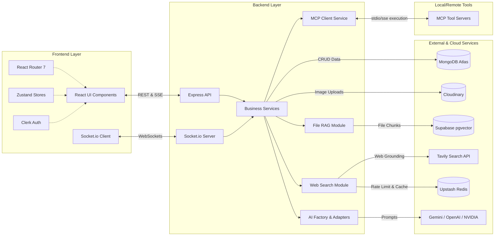
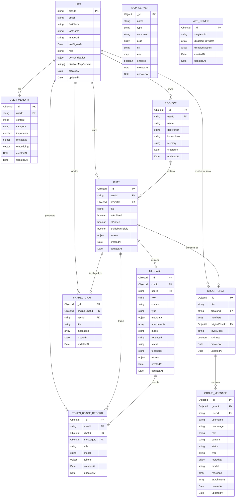

# Velora AI Technical Project Report

* **Project Name**: Velora AI
* **Type**: Full-Stack AI Platform
* **Codebase Size**: Approximately 36,500 lines of TypeScript and TSX code across 173 source files.
* **Date**: May 27, 2026

## 1. Project Overview

Velora AI is a comprehensive platform designed to facilitate interactions with multiple large language models. The system incorporates real-time streaming, long-term semantic memory, collaborative group chats, and tool extensibility through the Model Context Protocol. It is built to support robust contextual interactions by integrating web search, file-based retrieval-augmented generation, and persistent user memory.

### Key Capabilities

*   **Multi-Provider AI**: Supports models from Google Gemini, OpenAI, and NVIDIA using an adapter design pattern.
*   **Semantic Memory**: Employs MongoDB Atlas Vector Search for long-term user memory and Supabase pgvector for document analysis.
*   **Group Collaboration**: Provides real-time communication via Socket.io.
*   **Information Grounding**: Integrates Tavily for real-time web search with Redis-backed caching.
*   **Extensibility**: Supports Model Context Protocol tool integration for dynamically adding capabilities.

## 2. Technology Stack

### Frontend Components
| Technology | Purpose |
|---|---|
| **React 19** | UI framework |
| **Vite 8** | Build tool and development server |
| **TypeScript 6** | Type safety |
| **Tailwind CSS 4** | Styling |
| **Zustand 5** | Lightweight state management |
| **Clerk** | Authentication and user management |
| **React Router 7** | Client-side routing |
| **Socket.io Client 4.8** | Real-time group chat events |
| **React Markdown** | Rich markdown rendering |
| **Recharts** | Admin dashboard charts |

### Backend Components
| Technology | Purpose |
|---|---|
| **Node.js with Express 5** | HTTP server and API |
| **TypeScript 6** | Type safety |
| **MongoDB Atlas** | Primary database |
| **Supabase** | File storage and PostgreSQL pgvector |
| **Socket.io 4.8** | WebSocket for group chat |
| **Cloudinary** | Image upload and hosting |
| **Upstash Redis** | Caching and rate limiting |
| **Model Context Protocol SDK** | Tool server integration |

### AI Integrations
| Provider | Usage |
|---|---|
| **Google Gemini** | Primary text, vision, and embeddings |
| **OpenAI** | Alternative text and vision generation |
| **NVIDIA** | High-performance generation |
| **Tavily** | Web Search API for real-time grounding |

## 3. Architecture Overview



### Design Patterns

1. **Adapter Pattern**: AI providers implement an `IAIService` interface, making them swappable without changing business logic.
2. **Factory Pattern**: An `AIServiceFactory` manages provider registration and runtime selection.
3. **Service-Repository Pattern**: The backend separates business logic services from database access repositories.
4. **Optimistic UI**: Messages are displayed instantly and synced with the server asynchronously.
5. **Persistence-First**: User messages are saved to the database before calling the AI to prevent data loss.

## 4. Complete Folder and File Structure

Below is the exhaustive file structure for the client and server components:

```
client/src
├── App.tsx
├── components
│   ├── auth
│   │   └── ProtectedRoute.tsx
│   └── ui
│       ├── accordion.tsx
│       ├── avatar.tsx
│       ├── badge.tsx
│       ├── button.tsx
│       ├── card.tsx
│       ├── chart.tsx
│       ├── dropdown-menu.tsx
│       ├── input.tsx
│       ├── ServerDownBanner.tsx
│       ├── sonner.tsx
│       ├── spotlight-demo.tsx
│       ├── spotlight.tsx
│       └── tooltip.tsx
├── contexts
│   └── ServerStatusContext.tsx
├── features
│   ├── admin
│   │   ├── components
│   │   │   ├── McpAdminTab.tsx
│   │   │   ├── McpServerCard.tsx
│   │   │   └── McpServerModal.tsx
│   │   └── types
│   │       └── mcp.types.ts
│   ├── auth
│   │   └── hooks
│   │       └── useUserSync.ts
│   └── chat
│       ├── components
│       │   ├── ChatHeader.tsx
│       │   ├── ChatLayout.tsx
│       │   ├── CodeBlock.tsx
│       │   ├── ComposerQuotePreview.tsx
│       │   ├── CreateGroupModal.tsx
│       │   ├── DeleteConfirmModal.tsx
│       │   ├── GalleryModal.tsx
│       │   ├── GroupChatHeader.tsx
│       │   ├── GroupInputArea.tsx
│       │   ├── GroupLinkModal.tsx
│       │   ├── GroupMessageItem.tsx
│       │   ├── GroupMessageList.tsx
│       │   ├── InputArea.tsx
│       │   ├── Loading.tsx
│       │   ├── MarkdownConfig.tsx
│       │   ├── MemoryModal.tsx
│       │   ├── MessageItem.tsx
│       │   ├── MessageList.tsx
│       │   ├── MoveToProjectModal.tsx
│       │   ├── PersonalizationModal.tsx
│       │   ├── SearchModal.tsx
│       │   ├── SelectionToolbar.tsx
│       │   ├── SettingsModal.tsx
│       │   ├── ShareModal.tsx
│       │   ├── ShortcutsCheatsheetModal.tsx
│       │   ├── Sidebar.tsx
│       │   ├── SourceSidebar.tsx
│       │   └── TempChatBanner.tsx
│       ├── constants
│       │   └── chat.constants.ts
│       ├── hooks
│       │   ├── useAvailableProviders.ts
│       │   ├── useChatInput.ts
│       │   ├── useChatList.ts
│       │   ├── useChatMessages.ts
│       │   ├── useChatStream.ts
│       │   ├── useGallery.ts
│       │   ├── useGroupChat.ts
│       │   ├── useTemporaryChat.ts
│       │   ├── useTextSelection.ts
│       │   ├── useVoiceInput.ts
│       │   └── useWebSearchQuota.ts
│       ├── services
│       │   ├── chat.service.ts
│       │   ├── temporaryChat.service.ts
│       │   └── voiceInput
│       │       ├── voiceError.service.ts
│       │       ├── voiceProfanity.ts
│       │       └── voiceRequestMicPermission.service.ts
│       ├── store
│       │   ├── useChatStore.ts
│       │   ├── useComposerStore.ts
│       │   ├── useGroupStore.ts
│       │   ├── useProjectStore.ts
│       │   ├── useSelectionStore.ts
│       │   └── useTemporaryChatStore.ts
│       └── types
│           ├── chat.types.ts
│           └── project.types.ts
├── index.css
├── lib
│   ├── api.ts
│   └── utils.ts
├── main.tsx
└── pages
    ├── Admin.tsx
    ├── Auth.tsx
    ├── Chat.tsx
    ├── GroupChat.tsx
    ├── JoinGroupPage.tsx
    ├── Landing.tsx
    ├── ProjectsDashboardPage.tsx
    └── SharedChatPage.tsx
server/src
├── app.ts
├── config
│   └── db.ts
├── constants
│   ├── chat.constants.ts
│   └── prompt.constants.ts
├── controllers
│   ├── admin.controller.ts
│   ├── ai.controller.ts
│   ├── chat.controller.ts
│   ├── groupChat.controller.ts
│   ├── mcp.controller.ts
│   ├── project.controller.ts
│   ├── sharedChat.controller.ts
│   ├── temporaryChat.controller.ts
│   └── user.controller.ts
├── middleware
│   ├── auth.middleware.ts
│   └── error.middleware.ts
├── models
│   ├── Chat.model.ts
│   ├── GroupChat.model.ts
│   ├── McpServer.model.ts
│   ├── Project.model.ts
│   ├── SharedChat.model.ts
│   ├── UserMemory.model.ts
│   └── User.model.ts
├── modules
│   ├── file-rag
│   │   ├── config
│   │   │   └── supabase.ts
│   │   ├── fileHandler.ts
│   │   ├── fileParser.ts
│   │   ├── fileRetrieval.ts
│   │   ├── index.ts
│   │   ├── services
│   │   │   ├── embedding.service.ts
│   │   │   └── supabaseStorage.service.ts
│   │   ├── textSplitter.ts
│   │   └── types.ts
│   ├── tools
│   │   └── youtube
│   │       ├── index.ts
│   │       ├── transcript.ts
│   │       └── types.ts
│   └── web-search
│       ├── cache.ts
│       ├── confidence.ts
│       ├── index.ts
│       ├── queryResolver.ts
│       ├── quotaStatus.ts
│       ├── rateLimiter.ts
│       ├── reranker.ts
│       ├── webSearch.prompts.ts
│       ├── webSearch.service.ts
│       └── webSearch.types.ts
├── repositories
│   ├── chat.repository.ts
│   └── project.repository.ts
├── routes
│   ├── admin.routes.ts
│   ├── ai.routes.ts
│   ├── chat.routes.ts
│   ├── groupChat.routes.ts
│   ├── mcp.routes.ts
│   ├── memory.routes.ts
│   ├── project.routes.ts
│   ├── sharedChat.routes.ts
│   ├── temporaryChat.routes.ts
│   ├── upload.routes.ts
│   ├── user.routes.ts
│   └── webSearch.routes.ts
├── server.ts
├── services
│   ├── ai
│   │   ├── ai.factory.ts
│   │   ├── ai.interface.ts
│   │   ├── constants.ts
│   │   ├── providers
│   │   │   ├── claude.adapter.ts
│   │   │   ├── gemini.adapter.ts
│   │   │   ├── nvidia.adapter.ts
│   │   │   └── openai.adapter.ts
│   │   └── types.ts
│   ├── ai.service.ts
│   ├── buildProjectContext.ts
│   ├── chat.service.ts
│   ├── chatStreamRegistry.service.ts
│   ├── cloudinary.service.ts
│   ├── groupChat.service.ts
│   ├── groupStreamRegistry.service.ts
│   ├── mcpClient.service.ts
│   ├── memory.service.ts
│   ├── project.service.ts
│   ├── sharedChat.service.ts
│   ├── temporaryChat.service.ts
│   └── user.service.ts
├── types
│   ├── chat.types.ts
│   └── project.types.ts
└── utils
    ├── asyncHandler.ts
    ├── chatHistory.ts
    ├── groupSocket.ts
    ├── hash.ts
    ├── sse.ts
    └── tokenCounter.ts
```

## 5. Database Schema

The system utilizes MongoDB for standard operational data and user memory, alongside Supabase for document chunk embeddings.



## 6. Features Breakdown

### 6.1 Real-Time AI Streaming
The platform uses Server-Sent Events to deliver token-by-token responses. The frontend detects streaming status and connects to the active server stream. This allows for stream recovery on page reloads.

### 6.2 Multi-Provider AI
The backend implements an `IAIService` interface to abstract provider interactions. The `AIServiceFactory` resolves the correct adapter at runtime, supporting providers like Gemini, OpenAI, and NVIDIA.

### 6.3 Retrieval-Augmented Generation
Velora AI implements retrieval-augmented generation through distinct pipelines:
*   **User Memory**: Facts are extracted from user messages, embedded using Gemini, and stored in MongoDB Atlas. These facts are retrieved using Vector Search to provide persistent context.
*   **Document Analysis**: Uploaded files such as PDF, DOCX, and TXT documents are parsed, chunked using LangChain splitters, and embedded into a Supabase PostgreSQL database using pgvector. Relevant chunks are matched using cosine similarity via database function calls.
*   **Structured Data Operations**: Excel and CSV file parsing is handled externally by a dedicated MCP server (`excel-csv-mcp-server`). This specialized tool server grants the AI the ability to execute operations, filtering, and data manipulation directly on structured datasets.

### 6.4 Web Search Grounding
The web search module optimizes user queries using an AI model before fetching data via the Tavily API. Results are cached in Upstash Redis, deduplicated by hostname, and reranked using a combination of BM25 scoring and freshness heuristics. Citations are appended to the final response.

### 6.5 Collaborative Group Chat
Group conversations are managed via Socket.io. The system broadcasts events for new messages and user presence. Users can trigger the AI within a group chat using mentions, which prompts the backend to generate a response contextualized by the group history.

### 6.6 Tool Integration
The platform integrates the Model Context Protocol SDK to connect with external tool servers. Tool metadata is dynamically fetched and converted into provider-compatible function declarations. The AI adapter manages iterative function calling loops to resolve required tool actions.

### 6.7 YouTube Transcript Extraction
When a YouTube URL is detected, the system uses a transcript extraction library to obtain the video captions. This text is injected directly into the system prompt, allowing the AI to answer specific questions regarding the video content.

### 6.8 Project Workspaces
Users can organize conversations by project context. Projects contain custom instructions and specific memory that is prepended to AI prompts within that workspace.

### 6.9 Admin Analytics Dashboard
A secure dashboard is provided for administrators to monitor platform telemetry and manage users. Key functionalities include:
*   **Model Telemetry and Performance**: Visualizes global token consumption, model share percentages, and conversational density (average tokens per message) across all active AI adapters using Recharts.
*   **User Directory**: Allows administrators to view user-specific token usage, favorite models, and chat counts, as well as the ability to modify user roles.
*   **Dynamic Model Access Control**: A dedicated UI to globally disable or enable entire AI providers or specific models.
*   **Model Context Protocol Management**: Provides an interface to register, configure, and monitor external MCP tool servers globally.
*   **System Diagnostics**: Displays system status signals, active adapter counts, and aggregated payload comparisons.

## 7. Runtime Flow

### Sending a Standard Message
1. The user inputs a message in the frontend client.
2. The UI optimistically displays the message and a loading indicator.
3. The frontend initiates a request to the server streaming endpoint.
4. The server saves the user message to the database immediately.
5. The backend constructs a prompt incorporating system instructions, web search context, and retrieved memories.
6. The AI provider adapter executes an asynchronous generator, yielding text chunks.
7. The server sends these chunks to the client via Server-Sent Events.
8. The client accumulates the chunks in the state store and updates the UI.
9. Upon completion, the server saves the final response and processes any new user memories in the background.

## 8. Purpose and Goals

Velora AI is built to provide a unified AI workspace where individuals and teams can interact with multiple language models. The primary goals include:

*   **Provider Independence**: Avoiding vendor lock-in by supporting multiple language models.
*   **Contextual Intelligence**: Retaining user context and preferences across sessions.
*   **Real-Time Collaboration**: Facilitating shared, AI-powered team environments.
*   **Extensibility**: Providing a robust architecture for adding new tools and capabilities.

## 9. Key Technical Metrics

| Metric | Value |
|---|---|
| Total Source Files | 173 TypeScript and TSX files |
| Codebase Size | Approximately 36,500 lines |
| AI Providers Supported | Gemini, OpenAI, NVIDIA |
| Database Models | 11 Database schemas |
| Real-time Protocol | Server-Sent Events and WebSockets |
